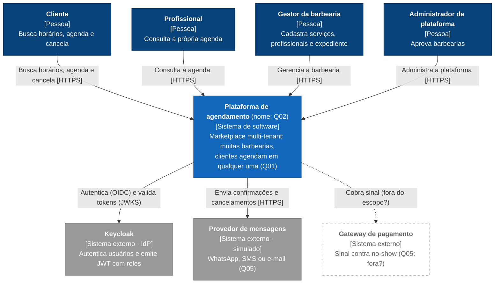
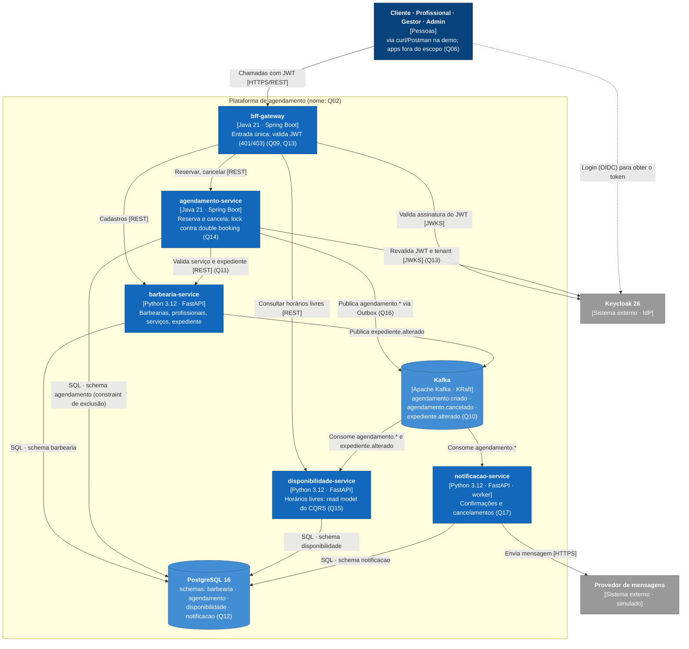

# Arquitetura: esboço do C4

> **Esboço para discussão.** Reflete os ADRs *Propostos* de 07/10/2026; nada está aceito. Onde houver **(Qnn)**, o elemento depende daquela [questão em aberto](../questoes-abertas.md).

- **Board no Miro (fonte do esboço, para discutir e mexer junto):** <https://miro.com/app/board/uXjVEdd_Nsc=/>
- **Esta página:** espelho em texto (Mermaid) para revisar no GitHub e versionar junto dos ADRs. Quem fechar uma questão atualiza os dois.
- **Versão final para a apresentação:** a definir na [Q24](../questoes-abertas.md#q24) (sugestão: draw.io com a notação C4, como o professor usa).

**Legenda:** azul = dentro do sistema · cinza = sistema externo · azul-escuro = pessoa · tracejado = em aberto ou fora do escopo.

## Nível 1 · Contexto

## Nível 2 · Containers

## Fluxo principal da demo (resumo)

1. Cliente obtém o token no Keycloak e chama o BFF (sem token: **401**; role errada: **403**).
2. Consulta horários livres → BFF → disponibilidade-service (read model).
3. Reserva → BFF → agendamento-service → valida no barbearia-service → grava com a constraint de exclusão (disputa: **409**) → Outbox → Kafka.
4. Kafka → disponibilidade-service atualiza o read model (o horário some da consulta) e notificacao-service envia a confirmação.
5. Trace da reserva inteira no Grafana (Tempo) e a latência no dashboard.

## Nível 3

A definir depois do [ADR-0010](../adr/0010-arquitetura-interna-dos-servicos.md). Proposta: componentes do agendamento-service (controller → use cases → aggregate `Agendamento` → repositório PostgreSQL e Outbox → publicador Kafka).
